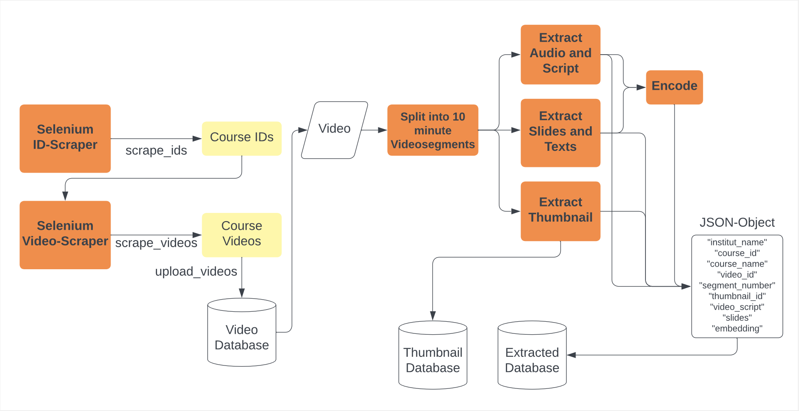
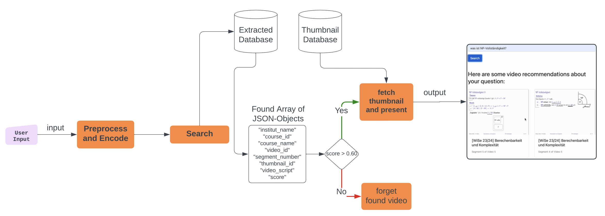

# Educational Video Training

## Motivation & Overview

The goal of this project is to significantly enhance the learning process by efficiently extracting and presenting information from educational videos in an optimal and accessible format for students. By streamlining the learning experience, this solution aims to make acquiring new material less overwhelming and more effective, allowing students to engage with content in a purposeful and structured manner.

- Step 1: Students can input a query related to their course material and receive targeted video recommendations that address their specific needs.
- Step 2: Students will be able to review relevant video segments before diving deeper into the material, allowing for more effective and focused learning.
- Step 3: By revisiting specific video sections as needed, students can reinforce their understanding and apply what they’ve learned in practice.

## Ideas:
- *A way to produce tutorial videos and lecture videos.*
- *Take recordings autoregressively guess what is said afterwards.*
- *Identify segments in audio and group them together or index them with keywords so that you can access relevant segments by demand.*
- *Video to text but from text to video: if we could get to relevant sections using natural language (or diagrams).*
- *Remember topic changes from sound and image.*

# Workflow
**Description:** The process begins with scraping educational videos from TU-Berlin university website 'ISIS'. The videos are then analyzed to extract key  content and generate recommendations based on student queries. This workflow ensures that students receive relevant and focused educational material. 

## Scraping Videos
- **Course IDs:** The first step is collecting course IDs from the university website. An automated Selenium scraper extracts course IDs, course names, and institute names, storing this metadata for further processing.
- **Course Videos:** After collecting the course IDs, the next step is to scrape the associated videos. These videos are downloaded and stored in a structured format for analysis.

## Analyzing Videos
- **Audio and Script:** The audio track is extracted from each video using 'VideoFileClip'. The extracted audio is then transcribed using 'faster-whisper' to generate a text script. This script allows for text-based analysis of the video content.
- **Slide and Text:** The visual content of the videos, particularly slides, is analyzed. Slide changes are detected using OpenCV, with frames being compared to identify significant changes. Once the slide changes are identified, Llama-Parse is used to extract text from each slide, enabling detailed analysis of the visual content.
- **Thumbnail:** For each video, a thumbnail is created by capturing a screenshot from the first second of the video. This thumbnail is then stored in a database with a unique object ID.
- **Text Preprocessing:** The transcribed text and the text extracted from slides are pre-processed to remove stopwords and other non-essential elements. The cleaned text is then converted into embeddings using SentenceTransformer and the 'all-mpnet-base-v2' model, enabling efficient and accurate text-based search.

- **Vector Search and Recommendations:** The processed text is indexed using vector search with cosine similarity. This allows students to input queries and receive recommendations based on the most relevant video segments, providing a tailored learning experience.

## Before using the Educational Functionality
- **Config.json:** To use the educational videos functionality, under eduVid-Directory a config.json file, including a MONGO_URI to our Database must be created. {"MONGO_URI": "..." }

### Subteam members

- **yetkin (Yetkin Zambelli)**
